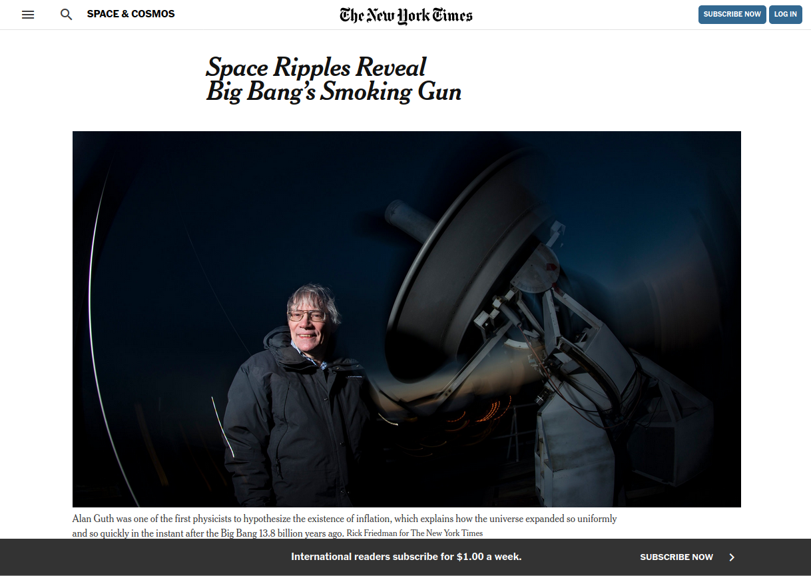

# New York Times Article Page Clone

> This project consists of cloning an article page of the The New York Times. Here is a link to the original page: (https://www.nytimes.com/2014/03/18/science/space/detection-of-waves-in-space-buttresses-landmark-theory-of-big-bang.html)

## Built With

- CSS,
- HTML

## Live Demo

[Live Demo Link](https://ezeilo-su.github.io/new-york-times-article-page/)

## Authors

👤 **Sunday Ezeilo**

- Github: [@ezeilo-su](https://github.com/ezeilo-su)
- Twitter: [@SundayEzeilo](https://twitter.com/SundayEzeilo)
- Linkedin: [Sunday Ezeilo](https://www.linkedin.com/in/sunday-ezeilo-a6a67664)

👤 **Guilherme Recordon**

- Github: [@guirecordon](https://github.com/guirecordon)
- Twitter: [@RecordonG](https://twitter.com/RecordonG)
- Linkedin: [Guilherme Recordon](https://www.linkedin.com/in/gui-recordon-marketingmba/)

## 🤝 Contributing

Contributions, issues and feature requests are welcome!

Feel free to check the [issues page](https://github.com/ezeilo-su/new-york-times-article-page/issues).

## Show your support

Give a ⭐️ if you like this project!